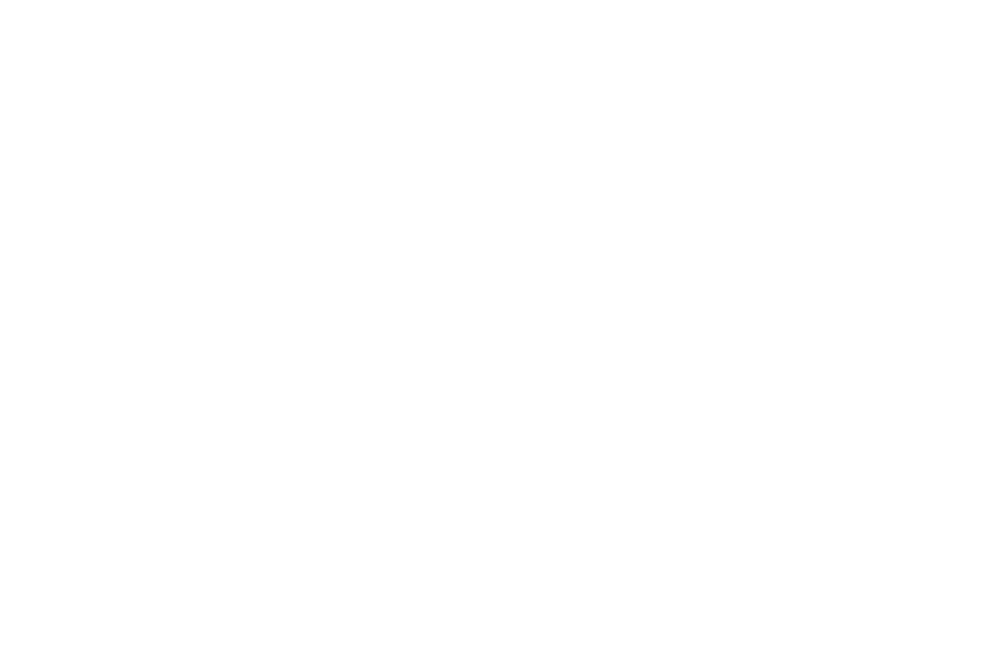
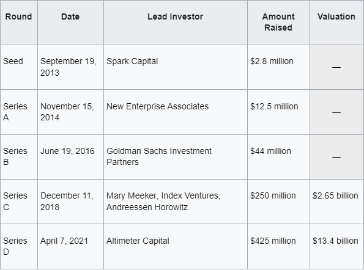

# Plaid

## Overview and Origin
In late 2013, Plaid was incorporated by its founders Zach Perret and Willaim Hockey. Today, Plaid provides developers with the tools they need to create easy and accessible experiences for their users. Tens of millions of people have successfully connected their financial institutions to apps they love using thanks to Plaid. This, however, wasn't the initial vision the founders had for their company. The pair of founders originally attempted to build consumer financial management products, including budgeting and bookkeeping software. When confronted with difficulties connecting bank accounts required for these tools, they decided to pivot their core business focus to a unified banking API which evolved into Plaid. To turn their vision into reality Plaid needed funding. The company was initially funded through seeding round investments and has continued to receive funding in this manner since their founding. In their most recent round, investors raised 425 million dollars for Plaid. Since the company’s founding, Plaid investors have raised over 759 million dollars. Here's a graph of their funding history.
#

#
## Business Activities
In a world that consistently trends towards digitalization and data collection, Plaid seeks to rectify the inaccessibility of financial data and tools that power Fintech and digital finance products. Plaid does this by offering access to their pre-existing financial database API and by providing their own digital infrastructure for connecting consumers to their banks and other financial services. They refer to this as their "Open Financial Ecosystem." This allows prevalent financial data and tools to be more easily accessible. This means their technologies can allow common apps such as Venmo and Chime to offer banking services without having to develop all the infrastructure themselves.
##
As a company “focused on democratizing financial services,” through networking API, their intended customers are the people who use fintech to manage their finances. As an API, this also means their customers are the fintech products/services who use their network. Plaid’s platform supports over 12,000 financial institutions so their 7000+ digital finance services can be accessible to a large consumer base. Plaid offers a menagerie of products to help people and financial institutions better manage their finances. Plaid gets their edge through their open financial ecosystem and pre-existing digital infrastructure, making their services invaluable to apps and financial institutions that don't have access to Plaid's database or a developed digital infrastructure.  
##
Plaid has a wide spread of notable technologies in use and in development: 

Plaid’s Core Exchange- Connectivity solution for delivering a variety of secure, easy to implement API products for all data partners.
##
Wallet Onboard (developing)- Takes UX and technical differences across more than 300 self custody crypto wallets so users can connect seamlessly.
##
Plaid Signal ACH risk assessment and scoring- Uses machine learning to indicate the likelihood of an AHC return to manage risk.
##
Identity VerificationGlobal KYC and Anti-fraud- combats fraud and verifies data.
##
MonitorAML and PEP screening- constrains searches to reduce false positives to maximize match rates and minimize costs based on customizable risk profile.
##
Plaid utilizes these technologies to protect their users, the data they collect and make managing finances more convenient for the end user.
## Landscape
As a Fintech, Plaid is a part of the payments domain. The payments domain has evolved tremendously in recent years from the advent of card payments linking bank accounts to financial institions digitally managing huge sums of money seamlessly. Lately, the digitalization trend has led to data collection which allows developers the data they need to create more value for their Fintech services. Notably, consumers can now manage their finances more easily now than ever before. Other major fintechs in the payment domain include Stripe, TripActions and Melio.
## Results
Plaid has made waves by providing developers with the tools they need to create easy and accessible experiences for their users as well as an easy way for consumers to connect to their bank accounts and manage their finances. This is clear when looking at core metrics. Plaid performs well on several noteworthy metrics, the most important of which would be the number of integrations/customers. Currently, Plaid possesses over 7000 partners in Fintech and supports over 12,000 financial institutions. Other important metrics are successful implementation of new technologies and transactional security. These two metrics can go hand in hand when looking at Plaid’s Identity VerificationGlobal KYC and Anti-fraud system protecting data and transactions.Plaid operates in the upper echelon of the payment domain, offering global services and a valuable network but in terms of funding and size stands beneath companies like Stripe and TripActions.

## Recommendations
If I were to advice Plaid, I would suggest that they offer their financial data and infrastructure to applied fintech startups that the company sees potential in. In doing so, Plaid would stand to gain revenue from service fees if their investment pays off. This would also increase the number of consumers using their services. Additionally, Plaid would have stake in the new fintech and even have the possibility of acquiring a startup in the long term. To do this Plaid would offer the data gathered from their API as well as their Fintech infrastructure to kick start new Fintechs with strong potential. These technological bequeathments are appropriate because the network would allow for the start up to have better knowledge of transactions from different entities at different levels which could be advantageous in seeking investors or other similar Fintechs. The infrastructure provided would also mean the up and coming Fintech wouldn’t need to devote time and other resources developing and testing their own, allowing them assert their focus more solely on the technology they’re developing.

## Citations
Forbes Magazine. (n.d.). Plaid | company overview & news. Forbes. Retrieved December 22, 2022, from https://www.forbes.com/companies/plaid/?list=fintech%2F&sh=25bbb88960d0 
##
Enabling all companies to build Fintech Solutions. Plaid. (n.d.). Retrieved December 22, 2022, from https://plaid.com/
##
Wikimedia Foundation. (2022, November 18). Plaid (company). Wikipedia. Retrieved December 22, 2022, from https://en.wikipedia.org/wiki/Plaid_(company) 
